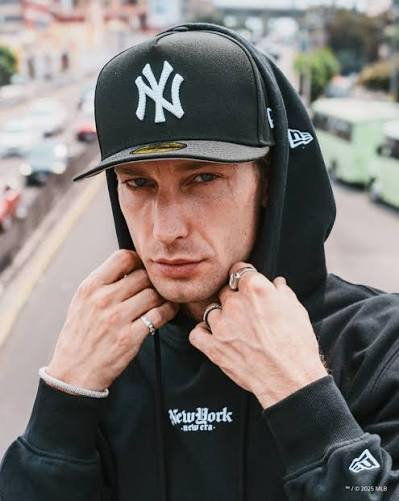

# Proto-persona — Altima.str

> Guía: [Proto-persona](../evaluacion/guias/fase-1-requerimientos/02-proto-persona.md)

## Proto-persona principal

**Matías "Mati" Rojas, 28 años.** Diseñador gráfico freelance y creador de contenido de moda urbana en Instagram, en Santiago.

> "Si la vi en un fit de Pinterest, la quiero. Pero no pago 50 lucas sin saber si es original y si me queda."

### Comportamientos

- Descubre gorras y outfits en **Instagram** (cuentas de streetwear, Hat Club, perfiles de *fits*) y guarda referencias en tableros de **Pinterest**. También ve *unboxings* en TikTok.
- Llega al sitio **desde el celular**, casi siempre tocando el link de una historia o del perfil de Instagram.
- Navega de **noche (22:00–01:00)** o en el **metro** camino a reuniones con clientes: sesiones cortas, con una mano.
- Su estilo es negro y sobrio: polerón con capucha, anillos plateados y una 59FIFTY de los Yankees como pieza principal. Sube sus *fits* a Instagram y le preguntan seguido dónde compra sus gorras.
- Compra 1 o 2 gorras al mes cuando le pagan a fin de mes. Paga con **débito o Mercado Pago**; nunca con transferencia a desconocidos.
- Ha comprado por DM a revendedores de Instagram y sigue a varios para no perderse los drops.

### Necesidades

- Encontrar rápido una gorra específica (equipo, color, colección o edición) sin recorrer todo el catálogo.
- Saber **qué talla de fitted le queda** (59FIFTY), porque no puede probársela.
- **Comprobar que la gorra es original** antes de pagar: ver fotos reales de etiquetas, *undervisor* y bordados.
- Saber el **precio final con despacho** a su comuna antes de llegar al pago.
- Enterarse a tiempo de los **drops y ediciones limitadas**.

### Motivaciones

- **Exclusividad:** tener un modelo que no use todo el mundo (*side patch*, colores poco comunes, colabs).
- **Armar su outfit:** la gorra es la pieza que cierra el *fit* que vio en Pinterest.
- **Coleccionar:** tiene más de 30 gorras y le importa el estado y la autenticidad de cada una.
- **Pertenencia:** ser reconocido en su grupo y en redes por su estilo.

### Frustraciones

- **Comprar una talla equivocada** porque la tienda no explica la equivalencia en centímetros, y no saber si puede cambiarla.
- **Miedo a las réplicas:** fotos de catálogo genéricas que no muestran la gorra real que va a recibir.
- **Revendedores por DM que demoran horas en responder** o piden transferencia sin boleta.
- **Ver el costo de envío recién al final** y que el precio suba de golpe.
- **Elegir una gorra y descubrir en el carrito que su talla está agotada.**
- Sitios lentos o difíciles de usar en el celular (filtros que no se ven, textos pequeños, formularios largos).
